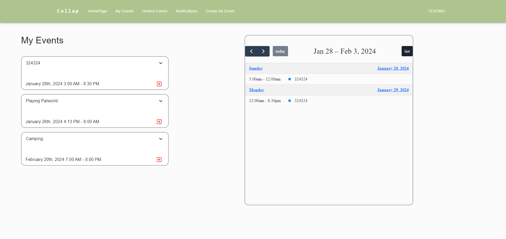

# Collap Application

This is the frontend to my web app Collap. Using a React Framework and Typescript, I'm able to connect my frontend to my Django Framework Backend. Documentation for the backend is found on my Repo. At the time of this README commit, I'm having a lot of issues with getting my Github repository to update on Azure, along with a multitude of errors, so for now the best I can show is a lot of documentation and screenshots.

## About this App

This is my very first real project and I decided to make an event planning application. Although this seems like an overly ambitious first project, this is my desired way of learning: to dive right in. Collap is an application that will allow users to HOST events with minimal details, and invite users who can contribute to the date of the event. It also includes a calendar that displays your events. My inspiration for this application was to solve issues planning events with large groups of people or with participants who were too reserved to contribute to any real planning of said event. Event Hosts are able to control many aspects of their events, such as start/end time, primary dates, participants, etc. The voting system for event is a simple way for hosts to understand every participant's preference in days. Hosts may start votes any time, and when they are completed they can be shown in a simple bar graph. Each participant is required to submit available dates for the time frame that was determined before joining an event. This is DIFFERENT than voting, it's simply availability that can be shown to hosts. This helps hosts determine the days in which some participants are UNABLE to come.

## Issues

Although I took a lot of time trying to document all the backend logic and endpoints, but it proved very difficult to see the BIGGER picture when planning something you've never done in your life. Looking back, it may have been more beneficial to simultaneously think about backend and frontend instead of going one at a time like I believed to be better. This way I could have identified more oversights and flaws with my design. However, this journey of struggle has taught me (in a tough way) a lot in how I must think about web development and all the meticulous planning I should do before actually creating code for a product. 

Another reflection I have about not seeing the larger scope during this project is not planning and implementing more features than I had designed the application to have. My application lacks some features that I had overlooked during my planning phase, and I regret not taking more time to add more to my application. It wasn't a large issue implementing these add-ons during the development process, but it was very difficult going through many ideas during development and spending more time delaying my overall progress with the project. At one point I decided that I need to ignore most ideas unless they were vital to the logic of the application. My lack of time and desire to put this project on my resume contributed to this decision.

## Links

#### Note IMPORTANT!!!
Feel free to register your own account to check it out, but since it's difficult to see all the features of an event planning application without many users and events, I've preloaded accounts with some data so that you can check it out! Feel free to modify any information on each of these acccounts
* username: githubexample1 password: githubexample1
* username: githubexample2 password: githubexample2
* username: githubexample3 password: githubexample3

### Hosted Project
#### Note
Free trial on Azure has terminated on 2/21/2024. Will look for new platform to host backend on 2/23/2024.

https://master--illustrious-unicorn-98eadd.netlify.app/
### Front End Documentation (This Repository)
https://github.com/shinste/collap_frontend
### Back End Documentation and Design 
https://github.com/shinste/collap_backend

## Documentation (Split by Pages)

### Login

A simple login page that gives a sneak peak of the calendar feature. Will give an error message on the screen for an invalid password/username.

### Registration

A simple registration page that will allow you to sign up for an account. Usernames are unique so think of a clever one. It will provide a link to the login page after a successful sign in.

### Home Page

The first page with a navigation bar, this is where you will be directed once there is a successful login. Notifications will show on the left hand, and will be marked by "Mandatory" text if its from an event that wants a vote. Although you cannot interact with the notifications on this page, there is a navigation link provided below the list. 

There is also a simple calendar feature that will display a event's primary date and time. You may look through all the months and see the various plans you've made.

### My Events

This page simply shows specific information about the events you are in participating in, you may click the drop down button to view the participants of that event. On the right you will be provided a list of events that are occuring that week. You may also leave an event using the red button on each event.

### Notifications

In the Notifications page, the notifications are separated into actions and simple information notifications. As you can see there is no dismiss button on the vote button, which forces the participant to provide dates to remove it. Theres also an invite notification that will be classified as an action, where you will be prompted to insert multiple days you are available. Simple information notifications will include being removed from an event, a new user joining an event you are in, etc.

### Hosted Events

The Hosted Event page is where hosts may access information and handle moving parts of an event. There are a lot of features to be useful to the host.

#### Date Manipulation

The current primary date and time for the event is already displayed, but there is a box that will allow you to change that information. The main part is the dropdown list with all the available dates for the event. The next thing is the date field where you can change the event end date, and the third is a time field where you can adjust the exact time if needed. Not all the fields need to be filled out to update the primary details.

The available dates list is all the dates that were suggested through each participant when joining. The host can choose to delete any of the events as long as its the current primary date (in that case it will be grayed out and won't be selectable). There is also a manual date inserter that the host can use at his/her discretion.

#### Voting

The voting feature for this application will handle only dates due to simplicity sake. Including time and event duration is a little overwhelming and falls beyond the scope of this project's purpose. By default each event does not require votes, but a host can decide to push the objective to vote with a button. Once votes are sent in, we get a counter to see how many of the participants vote, and a barchart displaying them.

Below the barchart is a section that recommends dates based on the available days each participant is required to give. Days where every user can attend the event are followed by green text, and dates where some users cannot make will have red text with a list of who is unable to attend. The decision to add this section, which may seem identical to the voting dates feature, is influence by a very important distinction between availability and preference. A date that is most voted on might not be the ideal choice when half of the participants are UNABLE to attend. Obviously if these two conditions, availability and preference, are the same, this addition may not be as useful.

#### Participants

This section displays users and an option to kick them from the event. There is also a textfield at the bottom which will send an invite to the specified user.

#### Delete Button

Upon pressing the "Delete Event" button, there will be a confirmation form that pops up where you can confirm your choice to delete the event.  

### Create Event

The information that is needed to create an event is prompted here. Event Name, Primary Date and Time, Participants, and your own availability. Once completing the form correctly, it will direct you to the homepage, and the event information will shown in appropriate pages (My Events and Hosted Events)

